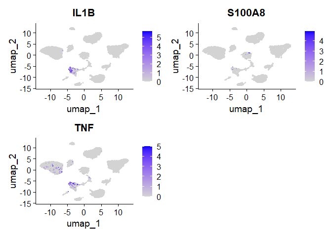

Clean environment

``` r
rm(list = ls())
```

``` r
library(Seurat)
library(ggplot2)
library(pheatmap)
library(dplyr)
```

Load Seurat object

``` r
object = readRDS("SkinAnnotatedSeuratObject.RDS")
print(object)
```

    ## An object of class Seurat 
    ## 59014 features across 11917 samples within 2 assays 
    ## Active assay: SCT (25320 features, 3000 variable features)
    ##  3 layers present: counts, data, scale.data
    ##  1 other assay present: RNA
    ##  3 dimensional reductions calculated: pca, harmony, umap

Clear the object, as we are going to perform the analysis from scratch,
so we only want the raw data

``` r
# Extract raw counts from the RNA assay
raw_counts <- GetAssayData(object, assay = "RNA", slot = "counts")
# Create a new Seurat object with only raw counts - this will automatically remove counts that have 0 values for all cells
new_object <- CreateSeuratObject(counts = raw_counts)

# copy over the metadata - only the important aspects eg. sample type and percentage of mitochondrial content- we dont want to copy the clustering information because we are doing that ourselves.
new_object@meta.data <- object@meta.data[1:8]

# Check new object
print(new_object) 
```

    ## An object of class Seurat 
    ## 33694 features across 11917 samples within 1 assay 
    ## Active assay: RNA (33694 features, 0 variable features)
    ##  1 layer present: counts

``` r
rm(object)
```

Get an idea of what the raw counts and meta data look like.

``` r
print(head(new_object@assays$RNA$counts))
```

    ## 6 x 11917 sparse Matrix of class "dgCMatrix"

    ##   [[ suppressing 48 column names 'AAACCCACACTTCAGA-1', 'AAACGAAAGCGTATAA-1', 'AAACGAAAGGAGATAG-1' ... ]]

    ##                                                                                                            
    ## RP11-34P13.3  . . . . . . . . . . . . . . . . . . . . . . . . . . . . . . . . . . . . . . . . . . . . . . .
    ## FAM138A       . . . . . . . . . . . . . . . . . . . . . . . . . . . . . . . . . . . . . . . . . . . . . . .
    ## OR4F5         . . . . . . . . . . . . . . . . . . . . . . . . . . . . . . . . . . . . . . . . . . . . . . .
    ## RP11-34P13.7  . . . . . . . . . . . . . . . . . . . . . . . . . . . . . 1 . . . . . . . . . . . . . . . . .
    ## RP11-34P13.8  . . . . . . . . . . . . . . . . . . . . . . . . . . . . . . . . . . . . . . . . . . . . . . .
    ## RP11-34P13.14 . . . . . . . . . . . . . . . . . . . . . . . . . . . . . . . . . . . . . . . . . . . . . . .
    ##                       
    ## RP11-34P13.3  . ......
    ## FAM138A       . ......
    ## OR4F5         . ......
    ## RP11-34P13.7  . ......
    ## RP11-34P13.8  . ......
    ## RP11-34P13.14 . ......
    ## 
    ##  .....suppressing 11869 columns in show(); maybe adjust options(max.print=, width=)
    ##  ..............................

``` r
print(head(new_object@meta.data))
```

    ##                       orig.ident nCount_RNA nFeature_RNA percent.mito nCount_SCT nFeature_SCT      SampleID
    ## AAACCCACACTTCAGA-1 SeuratProject       3509         1319   0.02878313       4551         1319 Sample1Normal
    ## AAACGAAAGCGTATAA-1 SeuratProject       5509         2016   0.05046288       5290         2014 Sample1Normal
    ## AAACGAAAGGAGATAG-1 SeuratProject       7303         2929   0.08024100       5744         2920 Sample1Normal
    ## AAACGAACATTCGGGC-1 SeuratProject       7425         2380   0.03595960       5589         2380 Sample1Normal
    ## AAACGAACATTGAAAG-1 SeuratProject       3123         1575   0.03522254       4435         1571 Sample1Normal
    ## AAACGAATCTACGCGG-1 SeuratProject       6008         2303   0.06491345       5484         2303 Sample1Normal
    ##                    SampleGroup
    ## AAACCCACACTTCAGA-1      Normal
    ## AAACGAAAGCGTATAA-1      Normal
    ## AAACGAAAGGAGATAG-1      Normal
    ## AAACGAACATTCGGGC-1      Normal
    ## AAACGAACATTGAAAG-1      Normal
    ## AAACGAATCTACGCGG-1      Normal

Quality control - we want to remove cells with high mitochondrial gene
expression, as this is a sign that the cell is stressed or dying. We
also want to remove cells with a very low or very high amounts of
detected genes, as these can represent empty droplets or droplets with
more than one cell in the data generation process.

``` r
#We already have the percentage of mitochondrial gene counts in our metadata.
#fliter out bad cells
new_object <- subset(new_object, subset = nFeature_RNA > 200 & nFeature_RNA < 5000 & percent.mito < 10)
```

Normalise between cells to account for differences in library size and
read depth.

``` r
new_object <- NormalizeData(new_object)
```

    ## Normalizing layer: counts

We can now look for the most varying genes in our dataset, as these will
hold the most biological meaning.

``` r
# Find the genes that vary the most between cells
new_object <- FindVariableFeatures(new_object, selection.method = "vst", nfeatures = 2000)
```

    ## Finding variable features for layer counts

``` r
print(VariableFeaturePlot(new_object))
```

    ## Warning in scale_x_log10(): log-10 transformation introduced infinite values.


Scale across genes to make them comparable.

``` r
new_object <- ScaleData(new_object, vars.to.regress = "percent.mito", features = VariableFeatures(new_object))
```

    ## Regressing out percent.mito

    ## Centering and scaling data matrix

``` r
# regress out the effect of mitochondrial genes
```

Perform a PCA on the processed data PCA is performed to lower the
dimensionality of the dataset.

``` r
new_object <- RunPCA(new_object, feature = VariableFeatures(new_object))
```

    ## PC_ 1 
    ## Positive:  LCP1, DUSP2, STAT4, GPR183, CD96, TRAF1, PIK3R5, PDE3B, PTPRJ, SIPA1L1 
    ##     LPXN, CCR7, CAMK4, RAB11FIP1, PDE4B, SERPINB9, P2RY8, CD69, CCL5, RGS1 
    ##     ISG15, TNIK, ICOS, HLA-DQB1, TYROBP, MCOLN2, TNFRSF18, CD58, BATF, TIGIT 
    ## Negative:  COL1A2, DCN, COL6A2, NNMT, COL6A1, CFH, COL3A1, CCDC80, PLPP3, CFD 
    ##     C1R, COL1A1, BICC1, ANK2, CXCL14, TWIST1, GSN, VCAN, LAMA2, NEGR1 
    ##     FBN1, MEG3, ROBO2, APOD, MMP2, TWIST2, ABI3BP, TNFAIP6, CTSK, MGP 
    ## PC_ 2 
    ## Positive:  CD96, CAMK4, PDE3B, ICOS, TNIK, P2RY8, TIGIT, PGAP1, STAT4, THEMIS 
    ##     CD69, SAMD3, BATF, AC092580.4, FAAH2, ITGA4, ANK3, CCL5, MT1X, IKZF2 
    ##     TNFRSF18, TOX, NKG7, SESN3, BTBD11, ZNF331, TRGC2, TNFSF8, GLCCI1, ACTA2 
    ## Negative:  HLA-DRA, HLA-DRB1, MCTP1, HLA-DPA1, HLA-DRB5, CD74, HLA-DQA1, HLA-DPB1, DOCK4, LYZ 
    ##     KYNU, ELOVL7, CLIC2, FLT1, FNIP2, CSF2RA, CXCL8, ADGRL4, G0S2, IL1B 
    ##     PLEK, KMO, PCAT19, MYO1E, PECAM1, C15orf48, TM4SF1, HLA-DQB1, IL3RA, NRP2 
    ## PC_ 3 
    ## Positive:  TM4SF1, ADGRL4, PCAT19, MAGI1, ERG, PALMD, RAPGEF4, PECAM1, ITGA6, PTPRB 
    ##     ACKR1, CNKSR3, VWF, PLVAP, MET, C2CD4B, SELE, MECOM, RALGAPA2, SNTG2 
    ##     FLT1, CD93, MAST4, ADAMTS9, TACR1, EMCN, RAMP3, KDR, SOX7, BACE2 
    ## Negative:  KYNU, PLEK, LYZ, PID1, AIF1, TYROBP, IL1B, CSF2RA, C15orf48, CCL3 
    ##     KMO, BCL2A1, SPI1, CCL3L3, FPR3, FCER1G, CTSZ, CD83, LST1, FAM49A 
    ##     LILRB2, CFD, TFEC, GPR183, FCGR2A, FTH1, ZEB2, SLAMF7, BASP1, CD86 
    ## PC_ 4 
    ## Positive:  SFN, SERPINB5, DSG3, DSC3, CLDN1, SERPINB2, DMKN, FAM83B, MAL2, DSG1 
    ##     DENND2C, S100A14, IRF6, CDH1, PERP, KRT1, TACSTD2, DSP, ABCA12, LY6D 
    ##     PPP1R14C, KRTDAP, KRT5, ZNF750, OVOL1, FGFBP1, KRT14, F2RL1, NEDD4L, LGALS7B 
    ## Negative:  ADGRL4, PECAM1, PCAT19, MCTP1, FLT1, ACKR1, PLVAP, VWF, EMCN, PTPRB 
    ##     ERG, SPARCL1, SELE, ZNF385D, C2CD4B, CD93, RAMP3, RALGAPA2, TACR1, MECOM 
    ##     CD74, RAPGEF4, KDR, CALCRL, ANO2, ADAMTS9, SNTG2, AQP1, PLEKHG1, TSHZ2 
    ## PC_ 5 
    ## Positive:  CXCL14, DCN, CFD, FBLN1, SFRP2, MMP2, CFH, PERP, DUSP1, VCAN 
    ##     THBS2, C3, LUM, MFAP4, TSHZ2, COL1A2, BICC1, WISP2, COL3A1, CLEC3B 
    ##     ZFP36, S100A16, TNFAIP6, C1R, LAMA2, DPT, ADH1B, SERPINF1, SFN, CP 
    ## Negative:  DCT, MLANA, TYRP1, TYR, TRPM1, FMN1, LINC01317, PMEL, OCA2, MDGA2 
    ##     CAPN3, CDH19, SOX6, DPP6, KIT, SNCA, ARMC9, MITF, BCAN, AC010967.2 
    ##     GCNT2, INPP4B, SLC7A8, PCSK2, DMD, RP11-669M16.1, RAB38, C10orf90, TEX41, VEPH1

``` r
print(new_object)
```

    ## An object of class Seurat 
    ## 33694 features across 11766 samples within 1 assay 
    ## Active assay: RNA (33694 features, 2000 variable features)
    ##  3 layers present: counts, data, scale.data
    ##  1 dimensional reduction calculated: pca

Plot an Elbow plot to identify how many dimensions to include.

``` r
print(ElbowPlot(new_object))
```

 It seems
like after 15 dimensions very little variability is captured, so we will
continue using 15 dimensions.

Next we will cluster the data using nearest neighbours.

``` r
new_object <- FindNeighbors(new_object, dims = 1:15, )
```

    ## Computing nearest neighbor graph

    ## Computing SNN

``` r
new_object <-FindClusters(new_object, resolution = 0.5)
```

    ## Modularity Optimizer version 1.3.0 by Ludo Waltman and Nees Jan van Eck
    ## 
    ## Number of nodes: 11766
    ## Number of edges: 383341
    ## 
    ## Running Louvain algorithm...
    ## Maximum modularity in 10 random starts: 0.9300
    ## Number of communities: 16
    ## Elapsed time: 2 seconds

``` r
# plot the clusters in a UMAP
new_object <- RunUMAP(new_object, dims = 1:15)
```

    ## 13:59:55 UMAP embedding parameters a = 0.9922 b = 1.112

    ## 13:59:55 Read 11766 rows and found 15 numeric columns

    ## 13:59:55 Using Annoy for neighbor search, n_neighbors = 30

    ## 13:59:55 Building Annoy index with metric = cosine, n_trees = 50

    ## 0%   10   20   30   40   50   60   70   80   90   100%

    ## [----|----|----|----|----|----|----|----|----|----|

    ## **************************************************|
    ## 13:59:57 Writing NN index file to temp file C:\Users\Reuben\AppData\Local\Temp\RtmpE9qlqa\file144c52147df0
    ## 13:59:57 Searching Annoy index using 1 thread, search_k = 3000
    ## 14:00:02 Annoy recall = 100%
    ## 14:00:04 Commencing smooth kNN distance calibration using 1 thread with target n_neighbors = 30
    ## 14:00:06 Initializing from normalized Laplacian + noise (using RSpectra)
    ## 14:00:07 Commencing optimization for 200 epochs, with 480148 positive edges
    ## 14:00:24 Optimization finished

``` r
print(DimPlot(new_object, reduction = 'umap'))
```


``` bash
#save processed object
#saveRDS(new_object, file = "filtered_scaled_seurat_object.rds")
```

``` r
# plot again labelling based on sample type to determine if we should use harmony integration.
print(DimPlot(new_object, reduction = 'umap', group.by = "SampleGroup"))
```


``` r
print(DimPlot(new_object, reduction = 'umap', group.by = "SampleID"))
```


Based on these two plots it does not appear that harmony is needed as
the different samples seem to be integrated, so there isnt a batch
effect.

``` r
#Find marker genes for each cluster
new_object.markers <- FindAllMarkers(new_object, 
                                only.pos = TRUE,
                                min.pct = 0.25,
                                logfc.threshold = 0.5)
```

    ## Calculating cluster 0

    ## Calculating cluster 1

    ## Calculating cluster 2

    ## Calculating cluster 3

    ## Calculating cluster 4

    ## Calculating cluster 5

    ## Calculating cluster 6

    ## Calculating cluster 7

    ## Calculating cluster 8

    ## Calculating cluster 9

    ## Calculating cluster 10

    ## Calculating cluster 11

    ## Calculating cluster 12

    ## Calculating cluster 13

    ## Calculating cluster 14

    ## Calculating cluster 15

``` r
#Extract top 3 markers for each cluster based on avg log2 fold change
top_markers <- new_object.markers %>% 
    group_by(cluster) %>%
    slice_max(n = 5, order_by = avg_log2FC)
print(top_markers)
```

    ## # A tibble: 80 × 7
    ## # Groups:   cluster [16]
    ##    p_val avg_log2FC pct.1 pct.2 p_val_adj cluster gene   
    ##    <dbl>      <dbl> <dbl> <dbl>     <dbl> <fct>   <chr>  
    ##  1     0       5.31 0.29  0.01          0 0       CTLA4  
    ##  2     0       4.78 0.415 0.032         0 0       FAAH2  
    ##  3     0       4.58 0.418 0.019         0 0       CD28   
    ##  4     0       4.46 0.256 0.024         0 0       RTKN2  
    ##  5     0       4.32 0.567 0.034         0 0       ICOS   
    ##  6     0       5.67 0.253 0.012         0 1       PLA2G2A
    ##  7     0       5.11 0.576 0.039         0 1       C3     
    ##  8     0       4.36 0.838 0.141         0 1       APOD   
    ##  9     0       4.13 0.638 0.07          0 1       PTGDS  
    ## 10     0       3.86 0.427 0.035         0 1       ABCA8  
    ## # ℹ 70 more rows

``` r
#Plot a single top marker gene for the first cluster using the UMAP too see what cells have a high expression level,
print(FeaturePlot(new_object, features = top_markers$gene[1]))
```


``` r
#We can see that high expression is mainly in the cluster 0 for this gene, which is expected. Now we need to determine what cell types each marker gene is associated with.
```

``` r
cell_markers <- list(
  Activated_T_cell = c("CD69", "IL2", "IFNG"),
  Adipocyte = c("APOE", "CFD", "ADIPOQ"),
  Antigen_presenting_cell = c("HLA-DRA", "CD74", "HLA-DPB1"),
  B_cell = c("CD19", "MS4A1", "CD79A"),
  Basal_cell = c("KRT14", "KRT5", "CDH3"),
  CD4_T_cell = c("CD3E", "CD4", "IL7R"),
  CD8_T_cell = c("CD8A", "CD8B", "GZMK"),
  Central_memory_T_cell = c("CCR7", "SELL", "CD45RO"),
  Conventional_dendritic_cell_1_cDC1 = c("IRF8", "CLEC9A", "BATF3"),
  Conventional_dendritic_cell_2_cDC2 = c("CD1C", "IRF4", "FCER1A"),
  Dendritic_cell = c("ITGAX", "CD1C", "HLA-DRA"),
  Dermal_cell = c("APCDD1", "SFRP2", "WIF1"),
  Differentiated_keratinocyte = c("KRT1", "KRT10", "IVL"),
  Dopamine_neuron = c("TH", "DDC", "SLC18A2"),
  Endothelial_cell = c("PECAM1", "VWF", "CDH5"),
  Epidermal_cell = c("EPCAM", "IVL", "TP63"),
  Fibroblast = c("COL1A1", "FAP", "PDGFRA"),
  Gamma_delta_T_cell = c("TRDC", "TRGC1", "NCAM1"),
  Healing_Enriched_Fibroblast = c("PLA2G2A", "COL1A1", "FBLN1"),
  Keratinocyte = c("KRT14", "KRT5", "SPRR2A"),
  Lymphatic_endothelial_cell = c("LYVE1", "PROX1", "PDPN"),
  Lymphocyte = c("CD3D", "CD7", "CD2"),
  M1_macrophage = c("IL1B", "S100A8", "TNF"),
  M2_macrophage = c("CD163", "MRC1", "CD204"),
  Macrophage = c("CD68", "CD163", "LYZ"),
  Mast_cell = c("TPSAB1", "TPSB2", "CPA3"),
  Melanocyte = c("MLANA", "PMEL", "TYR"),
  Memory_B_cell = c("MS4A1", "CD27", "CD19"),
  Memory_CD4plus_T_cell = c("CD4", "IL7R", "SELL"),
  Memory_T_cell = c("CD28", "SELL", "IL7R"),
  Monocyte = c("CD14", "LYZ", "FCN1"),
  Myeloid_cell = c("LYZ", "CD68", "CXCL8"),
  Myeloid_dendritic_cell = c("CD86", "CD40", "CD209"),
  Natural_killer_cell = c("NCAM1", "NKG7", "GZMB"),
  Natural_killer_T_cell = c("CD3E", "NKG7", "CCL5"),
  Papillary_fibroblast = c("PDPN", "COL6A1", "APCDD1"),
  Regulatory_T_cell = c("CD3E", "CTLA4", "FOXP3"),
  Resident_memory_T_cell = c("CD69", "ITGAE", "CXCR6"),
  Schwann_cell = c("SOX10", "PLP1", "S100B"),
  Smooth_muscle_cell = c("ACTA2", "TAGLN", "MYH11"),
  Sweat_and_sebaceous_gland_cell = c("DCD", "AQP5", "KRT7"),
  T_cell = c("CD3D", "CD3E", "CD2"),
  Tissue_resident_memory_T_cell = c("CD69", "ITGAE", "CXCR6")
)

cluster_cell_types <- list()

#Loop through each cluster number
for (cluster_num in unique(top_markers$cluster)) {
  
  #Get the top marker genes for this cluster
  top_genes <- top_markers[top_markers$cluster == cluster_num, ]$gene
  
  #Initialize an empty vector to hold matching cell types for this cluster
  cell_type_matches <- c()
  
  #Loop through each cell type in the marker list
  for (cell_type in names(cell_markers)) {
    genes <- cell_markers[[cell_type]]
    
    #Check if any of the top marker genes match the known markers for this cell type
    if (length(intersect(top_genes, genes)) > 0) {
      #Add the cell type name to the matches for this cluster
      cell_type_matches <- c(cell_type_matches, cell_type)
    }
  }
  
  #Add the cell types for this cluster into the main list
  cluster_cell_types[[as.character(cluster_num)]] <- cell_type_matches
}

# Now print or inspect the matched cell types for each cluster
print(cluster_cell_types)
```

    ## $`0`
    ## [1] "Memory_T_cell"     "Regulatory_T_cell"
    ## 
    ## $`1`
    ## [1] "Healing_Enriched_Fibroblast"
    ## 
    ## $`3`
    ## [1] "Smooth_muscle_cell"
    ## 
    ## $`4`
    ## [1] "Dermal_cell"
    ## 
    ## $`6`
    ## [1] "M1_macrophage" "Macrophage"    "Monocyte"      "Myeloid_cell" 
    ## 
    ## $`7`
    ## [1] "CD8_T_cell"
    ## 
    ## $`8`
    ## [1] "Differentiated_keratinocyte"
    ## 
    ## $`10`
    ## [1] "Melanocyte"
    ## 
    ## $`11`
    ## [1] "Lymphatic_endothelial_cell"
    ## 
    ## $`12`
    ## [1] "Sweat_and_sebaceous_gland_cell"
    ## 
    ## $`14`
    ## [1] "B_cell"        "Memory_B_cell"

``` r
#plot clusters for comparison
print(DimPlot(new_object, reduction = 'umap'))
```


#Now we have potential cell labels for each cluster. To finalise these
we should plot them to check.

``` r
#visualise marker expression for the two candidate cell types in cluster 0.
print(FeaturePlot(new_object, features = cell_markers[["Regulatory_T_cell"]]))
```


``` r
print(FeaturePlot(new_object, features = cell_markers[["Memory_T_cell"]]))
```


``` r
#Cluster 0 shows stronger expression of Regulatory T cell markers, 
#while Memory T cell markers are distributed across other clusters.
#We'll label cluster 0 as Regulatory T cells.
```

``` r
#visualise marker expression for the two candidate cell types in cluster 1.
print(FeaturePlot(new_object, features = cell_markers[["Healing_Enriched_Fibroblast"]]))
```


``` r
#A lot of these markers also overlap with cluster 4, so I am not confident to label this cluster  #Healing_Enriched_Fibroblast, however, it is likely some type of fiberblast still, so labelling 
#it fiberblast will be ok for now.
```

``` r
#cluster 2 was not found with our marker list, so we will move to cluster 3.
print(FeaturePlot(new_object, features = cell_markers[[ "Smooth_muscle_cell"]]))
```


``` r
# cluster 3 definitely seems to be a smooth muscle cell.
```

``` r
#cluster 4.
print(FeaturePlot(new_object, features = cell_markers[["Dermal_cell"]]))
```


``` r
# cluster 4 definitely seems to be a dermal cell.
```

``` r
#clusteer 5 was also missed out so we will look at cluster 6.

print(FeaturePlot(new_object, features = cell_markers[["M1_macrophage"]]))
```



``` r
print(FeaturePlot(new_object, features = cell_markers[["Macrophage"]]))
```


``` r
print(FeaturePlot(new_object, features = cell_markers[["Monocyte"]]))
```


``` r
print(FeaturePlot(new_object, features = cell_markers[["Myeloid_cell"]]))
```


``` r
# likely a Macrophage or myeloid cel
# This is not supprising as macrophages are a specialised type of myeloid cells.
```

``` r
# cluster 7 definitely a CD8 T cell
print(FeaturePlot(new_object, features = cell_markers[["CD8_T_cell"]]))
```


``` r
# cluster 8 definitely a Differentiated keratinocyte
print(FeaturePlot(new_object, features = cell_markers[["Differentiated_keratinocyte"]]))
```


``` r
# cluster 9 missed, cluster 10 definitely a Melanocyte
print(FeaturePlot(new_object, features = cell_markers[["Melanocyte"]]))
```


``` r
# cluster 11 definitely a Lymphatic endothelial cell
print(FeaturePlot(new_object, features = cell_markers[["Lymphatic_endothelial_cell"]]))
```


``` r
# cluster 12 definitely Sweat and sebaceous gland cells
print(FeaturePlot(new_object, features = cell_markers[["Sweat_and_sebaceous_gland_cell"]]))
```


``` r
#clusters 13 and 15 are missed
# cluster 14, definitely a B cell.
print(FeaturePlot(new_object, features = cell_markers[["B_cell"]]))
```


``` r
print(FeaturePlot(new_object, features = cell_markers[["Memory_B_cell"]]))
```


